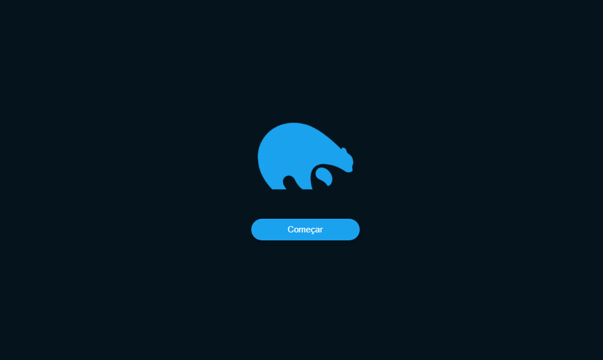

# MicroBlog Trapi
<div align="center">

</div>

</br>

### Esse site foi desenvolvido como processo seletivo para vaga de desenvolvedor fullstack na empresa <a href="https://trapi.com.br">Trapi</a>

</br>

<br/>

> Status: Finalizado!

## 💻 Running the app
```bash
# Install dependencies web
$ npm install
# Install dependencies api
$ composer install --no-scripts
$ php artisan key:generate
$ php artisan migrate --seed
$ npm install
```

```bash
# web
$ npm run dev
# api
$ php artisan serve
```


## 🧪 Technologies:

+ Next JS
+ Laravel
+ TypeScript
+ Tailwind CSS
+ MySql